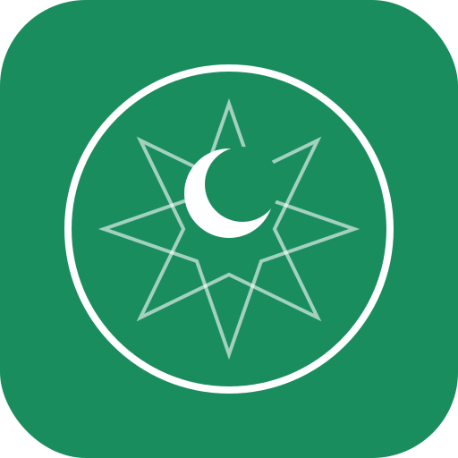

<p align="center">
  
</p>

<h1 align="center">وقت الصلاة — WaqtSalat</h1>

<p align="center">
  <strong>Prayer times PWA for Morocco</strong><br>
  Habous method &bull; Offline-first &bull; Zero tracking
</p>

<p align="center">
  <a href="https://github.com/waqtsalat/waqtsalat/actions/workflows/deploy.yml"></a>
  <a href="https://github.com/waqtsalat/waqtsalat/blob/main/LICENSE"></a>
  <a href="https://github.com/waqtsalat/waqtsalat/releases"></a>
  <a href="https://github.com/waqtsalat/waqtsalat/issues"></a>
  <a href="https://github.com/waqtsalat/waqtsalat/pulls"></a>
  <a href="https://github.com/waqtsalat/waqtsalat/stargazers"></a>
  <a href="https://github.com/waqtsalat/waqtsalat/network/members"></a>
  <a href="https://github.com/waqtsalat/waqtsalat/commits/main"></a>
  <a href="https://github.com/waqtsalat/waqtsalat"></a>
  <a href="https://github.com/waqtsalat/waqtsalat"></a>
  <a href="https://github.com/waqtsalat/waqtsalat"></a>
  <a href="https://waqtsalat.github.io/waqtsalat/"></a>
  <a href="https://github.com/waqtsalat/waqtsalat/graphs/contributors"></a>
  
  
  
  
  
</p>

---

## Morocco Only

> **This application is designed exclusively for Morocco.**
>
> All prayer times are calculated using the method of the **Ministere des Habous et des Affaires Islamiques** (Fajr 19°, Isha 17°). The timezone is hardcoded to `Africa/Casablanca` with Morocco-specific DST handling (including Ramadan decrees). Only Moroccan cities are included. This app will **not** produce correct prayer times for any other country.

---

## Features

- **Prayer times** — Habous method calculations validated against official data within ±1 minute tolerance
- **6 daily prayers** — Fajr, Chourouk (sunrise), Dhuhr, Asr, Maghrib, Isha
- **Trilingual** — Arabic (العربية), French (Francais), English — switchable instantly without reload
- **Full RTL support** — Native right-to-left layout for Arabic using CSS logical properties
- **Qibla compass** — 2D SVG compass with real-time device orientation (when available), AR mode as progressive enhancement
- **Offline-first PWA** — Works 100% offline after first visit. Zero network requests at runtime
- **Installable** — Add to home screen on Android and iOS with guided installation flow
- **Local notifications** — Prayer time alerts scheduled locally via Service Worker. No push server needed
- **Do Not Disturb** — Configurable quiet hours with per-prayer exemptions (e.g., Fajr alarm even during DND)
- **Pre-notifications** — Optional alerts 5/10/15/30 minutes before each prayer
- **Manual adjustments** — ±15 minutes per prayer to align with your local mosque
- **35+ Moroccan cities** — From Tangier to Dakhla, with GPS auto-detection
- **Hijri date** — Gregorian and Islamic calendar displayed side by side
- **Dark/Light/Auto theme** — Respects system preference, manually overridable
- **Zero tracking** — No cookies, no analytics, no external requests. Data stays in localStorage
- **Accessible** — WCAG 2.1 AA compliant: keyboard navigation, screen reader support, high contrast
- **Tiny footprint** — Single HTML file < 100 KB gzipped (built from modular ES modules via Vite)

## Demo

Visit the live app: **[waqtsalat.github.io/waqtsalat](https://waqtsalat.github.io/waqtsalat/)**

## Quick Start

```bash
git clone https://github.com/waqtsalat/waqtsalat.git
cd waqtsalat
npm install
npm run dev
```

Open the URL shown by Vite (usually `http://localhost:5173`).

## Development

```bash
npm install          # Install dev dependencies
npm run dev          # Start dev server with HMR
npm run build        # Build for production (dist/)
npm run preview      # Preview production build locally
npm test             # Run unit tests
npm run test:e2e     # Run Playwright e2e tests
```

## Project Structure

```
waqtsalat/
├── index.html              # HTML shell (JS/CSS bundled by Vite at build time)
├── public/
│   ├── sw.js               # Service Worker (cache-first, versioned)
│   ├── manifest.webmanifest
│   └── icons/
├── src/
│   ├── app.mjs             # Entry point
│   ├── state.mjs           # State management
│   ├── prayer.mjs          # Prayer calculation engine
│   ├── cities.mjs          # Moroccan cities database
│   ├── i18n.mjs            # Trilingual dictionaries
│   ├── constants.mjs       # Shared constants
│   ├── utils.mjs           # DOM helpers, timezone utilities
│   ├── compass.mjs         # Compass heading engine
│   ├── ar.mjs              # AR mode (lazy-loaded)
│   ├── sounds.mjs          # Audio playback
│   ├── notifications.mjs   # Notification system
│   ├── push.mjs            # VAPID push subscription
│   ├── install.mjs         # PWA install prompt
│   ├── capabilities.mjs    # Device capability detection
│   ├── styles.css          # All CSS
│   └── ui/                 # UI renderers
├── scripts/
│   ├── send-push.mjs       # Push notification sender (GitHub Action)
│   └── fetch-dataset.mjs   # Reference data fetcher
├── tests/
├── e2e/
├── docs/
│   ├── notifications.md    # Notification architecture
│   └── modules.md          # Module dependency graph
├── vite.config.mjs         # Build configuration
├── CLAUDE.md               # Claude Code development guide
└── LICENSE                  # GPL-3.0
```

> **Build output:** `npm run build` produces `dist/index.html` — a single self-contained file with all JS, CSS, and SVG inlined via Vite.

## How It Works

1. **First visit** — The app loads, the Service Worker caches all assets. The user picks a language and city (or uses GPS)
2. **Subsequent visits** — Everything served from cache. Zero network requests. Prayer times calculated locally using astronomical algorithms
3. **Notifications** — Scheduled locally via `setTimeout` in the Service Worker. Recalculated on each app open and at midnight
4. **Updates** — The browser checks for Service Worker changes ~every 24h. If updated, a banner prompts the user to refresh

## Prayer Calculation Method

| Parameter | Value |
|-----------|-------|
| Method | Ministere des Habous et des Affaires Islamiques |
| Fajr angle | 19° |
| Isha angle | 17° |
| Asr | Shadow = 1x object length + shadow at zenith |
| Timezone | `Africa/Casablanca` (with Morocco-specific DST) |
| Algorithm | Jean Meeus — Astronomical Algorithms |

## Contributing

Contributions are welcome. Please note:

1. **Morocco only** — Do not add support for other countries. This is by design.
2. **Minimum dependencies** — The production app uses Three.js for AR mode (loaded on demand). Core functionality has no external dependencies.
3. **Modular architecture** — All JS lives in ES modules under `src/`. Do NOT add inline `<script>` or `<style>` blocks to `index.html`. Vite handles bundling.
4. **Canonical modules** — `src/prayer.mjs`, `src/cities.mjs`, `src/i18n.mjs` are the single source of truth. Never duplicate their logic.
5. **Test first** — All prayer calculation changes must include tests validated against the Al Adhan API (method MOROCCO, id=21). Tolerance: ±1 minute.
6. **Accessibility** — Maintain WCAG 2.1 AA compliance. Test with screen readers.
7. **Single-file output** — `npm run build` produces a single self-contained `dist/index.html`. Source files are modular; production output is monolithic.

### Steps

```bash
# Fork and clone
git clone https://github.com/YOUR_USERNAME/waqtsalat.git
cd waqtsalat

# Install dev dependencies
npm install

# Make your changes
# ...

# Run tests
npm test

# Submit a pull request
```

## FAQ

**Q: Does this work outside Morocco?**
A: No. The prayer times use the Moroccan Habous method and only Moroccan cities are included. The timezone is fixed to `Africa/Casablanca`. Use a different app for other countries.

**Q: Why is there no choice of calculation method?**
A: This app targets Moroccan Muslims who follow the official Habous timings. Simplicity is a feature.

**Q: Do I need an internet connection?**
A: Only for the very first visit. After that, everything works offline, including prayer time calculations.

**Q: Does the app collect any data?**
A: No. Zero cookies, zero analytics, zero network requests after installation. Your settings are stored locally on your device in `localStorage`.

**Q: How close are the prayer times to the official schedule?**
A: Within ±1 minute of the official Habous times. The app uses the same astronomical algorithms and parameters.

**Q: Can I adjust times to match my local mosque?**
A: Yes. In Settings, you can adjust each prayer time by ±15 minutes in 1-minute increments.

**Q: How do notifications work without a server?**
A: WaqtSalat uses three layers: (1) Notification Triggers API for Chrome Android, (2) Service Worker polling as a fallback, and (3) VAPID web push via a GitHub Action running every 5 minutes for maximum reliability across platforms. See `docs/notifications.md` for details.

## License

[GPL-3.0](LICENSE) — Free software. You can redistribute and modify it under the terms of the GNU General Public License v3.
